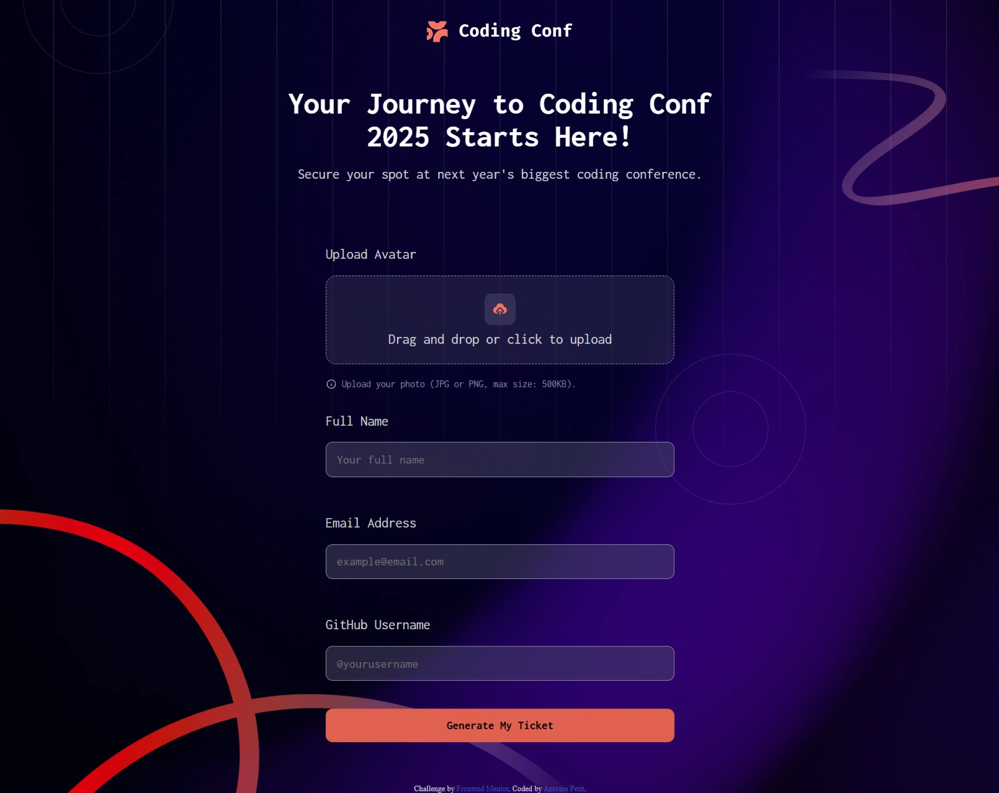
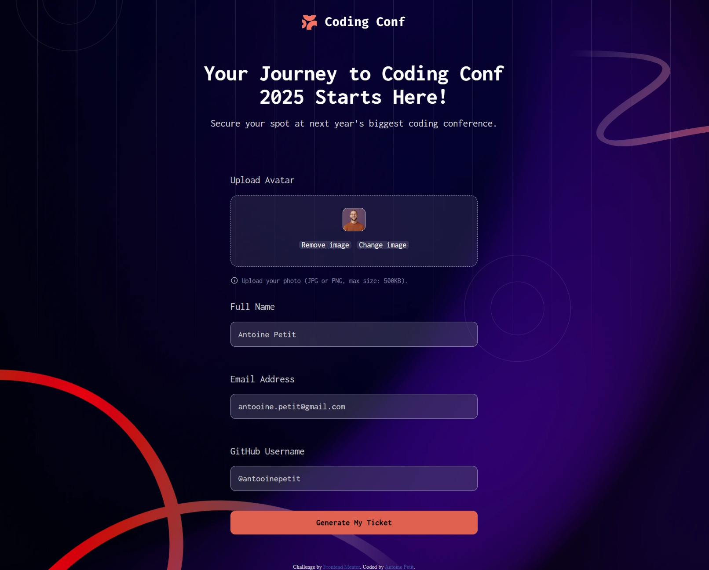

# Frontend Mentor - Conference ticket generator solution

This is a solution to the [Conference ticket generator challenge on Frontend Mentor](https://www.frontendmentor.io/challenges/conference-ticket-generator-oq5gFIU12w). Frontend Mentor challenges help you improve your coding skills by building realistic projects. 

## Table of contents

- [Overview](#overview)
  - [The challenge](#the-challenge)
  - [Screenshot](#screenshot)
  - [Links](#links)
- [My process](#my-process)
  - [Built with](#built-with)
  - [What I learned](#what-i-learned)
  - [Continued development](#continued-development)
  - [Useful resources](#useful-resources)
- [Author](#author)

## Overview

### The challenge

Users should be able to:

- Complete the form with their details
- Receive form validation messages if:
  - Any field is missed
  - The email address is not formatted correctly
  - The avatar upload is too big or the wrong image format
- Complete the form only using their keyboard
- Have inputs, form field hints, and error messages announced on their screen reader
- See the generated conference ticket when they successfully submit the form
- View the optimal layout for the interface depending on their device's screen size
- See hover and focus states for all interactive elements on the page

### Screenshot





### Links

- Solution URL: [Github pages](https://antooinepetit.github.io/Conference-Ticket-Generator/)

## My process

### Built with

- Semantic HTML5 markup
- CSS custom properties
- Flexbox
- CSS Grid
- JavaScript

### What I learned

I learned how to design and build a drag & drop area with JavaScript by getting the input hidden and using a div as the upload area
```js
const uploadArea = document.querySelector('#upload-area')
const fileInput = document.querySelector('#avatar')
let imageUrl = "";
const infoImage = document.querySelector('#info-image')


uploadArea.addEventListener('dragover', (e) => {
   e.preventDefault()
   uploadArea.classList.add('dragover')
})

uploadArea.addEventListener('dragleave', (e) => {
   e.preventDefault()
   uploadArea.classList.remove('dragover')
})

uploadArea.addEventListener("drop", e => {
   e.preventDefault();
   uploadArea.classList.remove("dragover");
   uploadImage(e)
});

fileInput.addEventListener('change', (e) => {
   uploadImage(e)
})

uploadArea.addEventListener('click', ()=> {
   if(imageUrl == ""){
      fileInput.click()
   }
})
```
I also learned that you can work with multiple backgrounds at the same time on a single element and how to manipulate each background
```css
main{
   background-image: 
   url("../assets/images/background-desktop.png"),
   url("../assets/images/pattern-lines.svg"),
   url("../assets/images/pattern-squiggly-line-bottom-desktop.svg"),
   url("../assets/images/pattern-squiggly-line-top.svg"),
   url("../assets/images/pattern-circle.svg"),
   url("../assets/images/pattern-circle.svg");
   background-position-x: center, center, left, right, 3%, 77%;
   background-position-y: center, top, bottom, 10%, -12%, 55%;
   background-repeat: no-repeat, no-repeat, no-repeat, no-repeat, no-repeat, no-repeat;
   background-size: cover, contain, 60%, 30%, 15%, 15%;
   background-blend-mode: overlay;
}
```
I learned how to create a fake URL to use an image without actually uploading it since I'm not working with a server to stock the image, and also making it easier to display it in my HTML
```js
let imageUrl;
const dataTransfer = new DataTransfer();
dataTransfer.items.add(file);
fileInput.files = dataTransfer.files;

imageUrl = URL.createObjectURL(file);
```

### Continued development

I'll keep working on drag & drops area since I haven't completely mastered it. I also planned on learning how to manipulate SVG because I don't know how to modify it's color and I want to understand how it works.

### Useful resources

- I mainly used ChatGPT to help me find fixes to some problems and Brave/Google to look more into details for the methods I didn't know before.

## Author

- Website - [Antoine Petit](https://github.com/AntooinePetit)
- Frontend Mentor - [@AntooinePetit](https://www.frontendmentor.io/profile/AntooinePetit)
